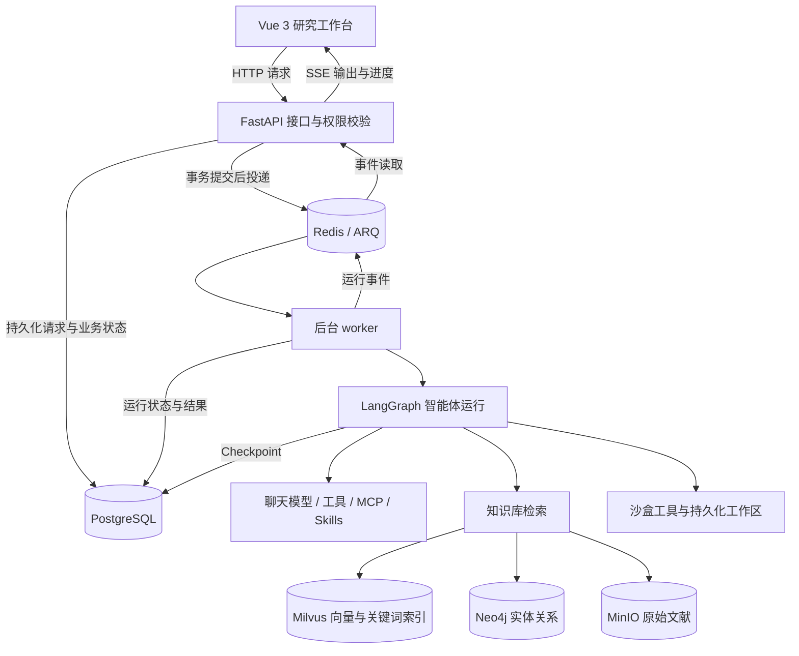

# 面向车联网领域的文献调研智能体平台

围绕车联网研究中的资料整理、论文阅读、方法对比与综述撰写，将大模型、检索增强生成（RAG）、知识图谱和多智能体协作整合到一个可私有部署的研究工作台。

[快速启动](#快速启动) · [完成第一次文献调研](#完成第一次文献调研) · [系统架构](#系统架构) · [使用文档](docs/index.md) · [English / 通用平台说明](README.en.md)

## 项目简介

本项目面向车联网（Internet of Vehicles，IoV）领域的文献调研场景，为研究者提供从文献入库、证据检索到分析报告交付的工作环境。用户可以导入论文、技术报告和标准资料，围绕一个研究问题发起任务，由智能体检索相关片段、拆分调研子问题、核验关键结论，并整理带来源的研究结果。

平台重点连接三个环节：

- **资料管理**：把分散的论文与技术资料整理为可检索、可共享的专题知识库。
- **研究分析**：结合本地文献检索、按需启用的网页搜索和多智能体协作，辅助阅读、比较与归纳。
- **结果交付**：将证据、方法对比和调研结论整理为可查看、可下载的文件，供后续复核和写作使用。

当前代码提供通用知识库与深度研究能力；车联网方向通过领域语料、研究问题和智能体配置落地。下文中的领域选题与输出模板是使用示例，不表示仓库已经内置车联网论文全集、专用领域模型或固定的文献综述流水线。

## 面向哪些研究场景

| 调研方向 | 可以提出的研究问题 | 建议整理的结果 |
| --- | --- | --- |
| 车联网通信与 V2X | 已导入的 C-V2X / NR-V2X 文献分别研究了哪些通信场景与约束？ | 技术路线、场景假设、关键指标与来源对照 |
| 车载边缘计算与任务卸载 | 不同卸载方法如何描述时延、能耗与资源约束？ | 问题建模、求解方法、实验设置和局限性对比 |
| 车路协同与协同感知 | 不同文献如何处理信息融合、通信开销与感知效果之间的关系？ | 方法分类、数据集、评价指标与适用条件 |
| 联邦学习与隐私保护 | 相关方案采用了什么参与方设定、训练机制与隐私假设？ | 方法异同、实验依据和未解决问题 |
| 资源分配与网络优化 | 优化方法使用了哪些目标函数、约束条件和基线？ | 优化目标、算法类别与可比性分析 |
| 专题综述与选题准备 | 某一主题有哪些研究分支、代表性方法和证据缺口？ | 文献矩阵、综述提纲与待验证的研究问题 |

这些场景依赖实际导入或检索到的资料。平台不会仅凭研究主题自动获得论文全文，也不把不同实验条件下的性能数字直接当作可比较结论。

## 核心功能

### 1. 文献入库与专题知识库

- 支持 PDF、Word、PPT、Excel、Markdown 等资料的处理，具体解析能力取决于文件格式和已配置的解析器。
- 通过文档解析、分块、嵌入模型（Embedding）与索引，将资料转化为可检索的文本片段。
- 可接入 MinerU、PaddleX、RapidOCR 等文档解析或 OCR 能力，用于不同类型的论文和扫描资料。
- 查看文件处理状态、解析结果与分块内容，定位文献未入库、解析失败或检索不命中的原因。
- 按课题、研究方向或资料类型组织知识库，并设置读取与管理范围。
- 支持连接 Dify、Notion 等已有知识源；这类只读连接器的能力与本地 Milvus 知识库不同。

对于双栏论文、复杂公式与表格，应先抽查解析结果，再开展批量调研。解析成功不等于版面和语义已经完整保留。

### 2. RAG 检索与来源追溯

知识库使用 Milvus 提供向量检索、BM25 关键词检索与混合检索，可按需启用重排模型（Rerank）和图谱增强检索。

```text
论文 / 技术资料
  → 解析与分块
  → 嵌入模型 + Milvus 索引
  → 向量 / BM25 / 混合召回
  → 可选图谱增强与重排序
  → 带来源的证据片段
  → 智能体分析与回答
```

- 语义检索用于寻找与研究问题相关的表述，关键词检索用于匹配术语、缩写和方法名称。
- 在检索测试中调整候选数量、检索模式与重排配置，检查相关文献是否真正被召回。
- 通过知识库工具打开文档上下文、定位关键词和查看来源，支持从结论回到原文核对。
- 使用 `knowledge-base` Skill 将知识库检索与文档阅读能力提供给智能体。

来源追溯用于辅助核验，不保证模型的归纳、引用或推断一定正确；关键数据和结论仍需要回读原文。

### 3. 多智能体调研与事实核查

平台基于 LangGraph、LangChain 与 DeepAgents 相关组件组织智能体运行，已有深度研究与子智能体配置：

| 智能体 | 标识 | 职责 |
| --- | --- | --- |
| 深度研究 | `deep-research` | 澄清范围、拆解问题、调度子任务并综合报告 |
| 调研探索员 | `research-explorer` | 围绕单个子问题检索资料，返回带来源的结构化发现 |
| 事实核查员 | `fact-verifier` | 核验关键论断，给出支持、存疑或反驳的依据 |

例如，针对“车载边缘计算中的任务卸载方法”，主智能体可以分别调研问题建模、算法分类和实验设置，再核查关键比较结论。具体任务拆分由提示词、配置和运行情况决定，并非写死的车联网专用流程。

- 支持同步委派和异步子任务，以及状态查询、等待和取消。
- 主、子智能体可以分别配置模型、工具、知识库、MCP 与 Skills。
- 子智能体拥有独立的对话上下文；同一执行树共享项目工作目录，并发写文件时需要使用不同输出路径。
- 配合待办、上下文压缩和执行状态展示，支持多步骤研究任务。

### 4. 网页搜索、MCP 与 Skills 扩展

- **网页搜索**：配置豆包搜索或 Tavily 后，智能体可检索网页资料，补充本地知识库之外的证据。
- **MCP**：通过模型上下文协议（Model Context Protocol）连接外部工具服务，扩展资料获取与分析能力。
- **Skills**：将研究流程、工具依赖与输出要求组织为可复用技能，按需加载到智能体运行中。
- **人工审批**：根据工具审批策略，在需要用户确认的操作处暂停并等待处理。

联网能力需要对应服务和密钥；可检索范围、访问权限及费用由实际接入的服务决定。普通网页搜索不等同于学术数据库的完整检索，也不提供付费论文访问授权。

### 5. 知识图谱与知识导图

- 从知识库文档块中抽取实体与关系，在 Neo4j 中存储图谱，并与检索链路结合。
- 通过图谱视图浏览节点、关系与关联子图，辅助探索资料之间的联系。
- 通过知识导图查看文献目录和元数据组织结构。

面向车联网调研，可以围绕“研究问题—方法—应用场景”等关系组织分析，但领域实体定义和抽取效果需要结合语料验证。文档实体关系图不等同于经过 DOI 校验的论文引文网络。

### 6. 研究工作台与文件交付

- 在对话中使用 `@` 引入知识库、文件或 Skill，围绕选定资料连续追问。
- 通过服务端事件流（SSE）展示输出、工具调用和任务状态。
- 智能体可利用工作区和沙盒工具生成 Markdown、CSV、HTML 等研究文件。
- 在工作区查看、预览和下载产物，保留后续写作与复核所需的中间资料。
- 沙盒按需创建；项目工作目录可在任务结束后保留，支持持续整理同一课题。

报告内容、文件类型和完整度取决于任务要求、模型、工具与运行结果，不是每次对话都会自动生成全部文件。

### 7. 权限管理与效果评估

- 按用户、部门和共享范围管理知识库、智能体与扩展资源，后端执行最终权限校验。
- 集中配置聊天、嵌入和重排模型，管理模型供应商及 API Key。
- 构建知识库评估集，比较分块、嵌入模型与检索配置，查看 `recall@K`、`f1@K` 等指标。
- 配置参考答案与评判模型后，可进一步评估答案正确性；也可接入 Langfuse Dataset 评估完整智能体任务。
- 通过运行记录与管理看板查看调用情况、任务状态和模型用量。

评估结果应在固定语料、模型与检索配置下比较。检索指标、模型评分与文献结论的学术可信度是不同的评价对象。

## 调研工作流

以下是基于现有能力组织的一种使用方式，不是强制执行的固定流程：


开展调研时，建议明确四项约束：

1. **研究范围**：主题、时间范围、语言与纳入 / 排除条件。
2. **证据范围**：只使用上传文献，还是允许补充联网资料。
3. **比较维度**：问题定义、场景假设、算法、数据集、基线、指标与局限性。
4. **交付要求**：报告结构、引用方式、文件格式，以及证据不足时如何标注。

## 系统架构

平台采用前后端分离与后台任务执行架构。FastAPI 接收请求，PostgreSQL 保存业务状态，Redis / ARQ 负责投递与短期事件，独立 worker 执行智能体和知识处理任务。



### 技术栈

| 层次 | 主要技术 | 项目中的作用 |
| --- | --- | --- |
| 前端 | Vue 3、Vite、Pinia、Ant Design Vue | 对话、知识库、工作区与管理界面 |
| 可视化 | AntV G6、ECharts、Markmap | 图谱、统计图表与知识导图 |
| API 服务 | Python、FastAPI | 接口、认证、权限与业务用例 |
| 智能体 | LangGraph、LangChain、DeepAgents | 工具调用、状态持久化、多智能体与中间件 |
| 后台执行 | ARQ、Redis | 任务投递、运行事件与取消信号 |
| 关系存储 | PostgreSQL、SQLAlchemy | 业务记录、请求队列、运行状态与 Checkpoint |
| 检索与图谱 | Milvus、Neo4j | 向量 / 关键词检索与实体关系查询 |
| 文档与对象 | MinIO、MinerU、PaddleX、RapidOCR | 原始资料存储、解析与 OCR |
| 评估与观测 | 知识库评估模块、可选 Langfuse 集成 | 检索质量比较与智能体任务评估 |
| 部署 | Docker Compose | 应用与依赖服务的编排部署 |

### 工程实现要点

- **请求与执行分离**：先保存消息和请求，再投递后台执行，避免长任务占用普通 HTTP 请求。
- **线程内有序处理**：同一用户、智能体和线程的普通请求按 FIFO 排队；不同请求与运行分别记录状态。
- **运行所有权与故障收敛**：worker 使用租约与心跳维护执行所有权，失联运行会进入可观察的失败状态。
- **持久化与事件分工**：PostgreSQL 保存最终业务事实，Redis 提供投递、缓存和短期事件，不作为最终结果的唯一来源。
- **流式交互与恢复**：前端通过 SSE 接收进度，并结合持久化状态处理断线恢复与终态补偿。
- **访问与路径边界**：后端校验资源可见性，工作区和沙盒在文件访问边界校验路径；前端隐藏入口不代替授权。

具体运行链路、服务职责与约束见 [ARCHITECTURE.md](ARCHITECTURE.md)。

## 快速启动

### 环境准备

- Docker Engine / Docker Desktop 与 Docker Compose v2；Windows 使用 Linux 容器环境。
- 可用的聊天模型与嵌入模型；需要重排序时再配置重排模型。
- 能访问镜像仓库及所选模型服务的网络。
- 需要联网调研时，准备支持的搜索服务密钥。

默认开发拓扑不要求 GPU；Compose 中的本地 MinerU、PaddleX 服务有额外 GPU 要求，详见[文档处理与 OCR](docs/advanced/document-processing.md)。模型调用、搜索和外部服务可能产生费用。

### 1. 获取项目

```bash
git clone https://github.com/zhao0717/agent.git
cd agent
```

已有源码时直接进入包含 `docker-compose.yml` 的项目根目录。

### 2. 初始化配置

Linux / macOS：

```bash
bash scripts/init.sh
```

Windows PowerShell：

```powershell
.\scripts\init.ps1
```

初始化脚本以 SiliconFlow 为例收集模型密钥，可选配置网页搜索，并创建或补齐 `.env`、生成独立的安全密钥、拉取基础镜像。使用其他模型服务时，可从 [.env.template](.env.template) 手动配置，操作说明见[快速开始](docs/intro/quick-start.md)与[模型配置](docs/intro/model-config.md)。

不要提交 `.env` 或真实密钥；已有部署升级时保留原有安全密钥。

### 3. 启动服务

```bash
docker compose up --build -d
docker compose ps
```

默认拓扑包括 API、worker、前端、存储迁移器、沙盒 provisioner，以及 PostgreSQL、Redis、MinIO、Milvus、etcd 和 Neo4j 等依赖。首次启动需要下载镜像并构建应用。

### 4. 检查就绪状态

Linux / macOS：

```bash
curl --fail http://localhost:5050/api/system/ready
```

Windows PowerShell：

```powershell
Invoke-RestMethod http://localhost:5050/api/system/ready
```

返回 `status: ready` 表示接流量的前置条件满足；还需要实际登录、配置模型并完成一次检索或对话，才能验证业务链路。

| 入口 | 默认地址 |
| --- | --- |
| 研究工作台 | [http://localhost:5173](http://localhost:5173) |
| API 文档 | [http://localhost:5050/docs](http://localhost:5050/docs) |
| 就绪检查 | [http://localhost:5050/api/system/ready](http://localhost:5050/api/system/ready) |

首次打开工作台时，按页面提示初始化超级管理员。若调整了部署端口，使用实际配置的地址。

这是开发环境启动方式。生产部署、备份与迁移请阅读[生产部署与升级](docs/advanced/deployment.md)；从 `v0.7.1` 升级前需要完成对应迁移，不能直接复用旧数据启动。

## 完成第一次文献调研

### 1. 准备一组可核验的文献

选择一个明确主题，例如“车载边缘计算中的任务卸载”，准备已获得访问和使用权限的论文或技术资料。首次验证使用少量文档，便于检查解析质量与引用是否正确。

### 2. 创建并验证知识库

1. 使用管理员账号创建 Milvus 知识库，选择可用的嵌入模型与分块策略。
2. 上传资料并完成解析、索引，确认目标文件状态为 `indexed`。
3. 在“检索测试”中输入文献中的特定术语或问题，核对命中文件和原文片段。
4. 根据实际效果选择向量、关键词或混合检索，需要时启用重排。

具体操作见[知识库教程](docs/intro/knowledge-base.md)。文件上传成功不代表已经完成索引。

### 3. 配置研究智能体

- 配置聊天模型，并将目标知识库加入智能体的可用范围。
- 确认 `knowledge-base` Skill 可见，以便检索和阅读文献。
- 需要多来源调研时，使用“深度研究”智能体，检查 `deep-research` Skill、调研探索员和事实核查员是否可用。
- `deep-research` Skill 声明了 `web_search` 工具依赖，联网调研前应配置搜索服务。
- 子智能体有自己的配置；需要使用文献知识库时，也要检查其知识库与 Skill 设置。

只想先验证本地文献问答，可以使用启用了 `knowledge-base` 的普通智能体，不必从复杂调研任务开始。

### 4. 发起研究任务

以下提示词是可自行调整的使用示例，不是预置任务按钮。

**文献梳理与方法对比：**

```text
请基于我选择的“车载边缘计算”知识库，调研任务卸载相关文献。

按研究问题、系统假设、优化目标、求解方法、实验设置和局限性分类整理。
对每篇文献区分作者明确报告的结论与推断，并标注来源文件及对应依据。
比较实验结果时说明数据集、基线和约束是否一致，不能直接横向比较的要标注原因。
最后输出一份方法对比表和综述提纲；资料未覆盖的内容明确写“未找到依据”。
```

**多子问题深度调研（需配置联网能力）：**

```text
围绕“车联网中的联邦学习与隐私保护”开展专题调研。
先明确资料范围，再分别整理应用场景、方法分类和实验评价。
结合已选择的知识库与可访问的公开来源，对关键论断进行交叉核验。
保留来源分歧，不编造论文名称、DOI 或实验数值。
输出结构化报告、参考来源和仍需人工核查的问题。
```

**生成研究文件：**

```text
请将本次已经核验的研究结果保存为工作区文件：
1. literature-review.md：研究背景、方法分类、比较分析、局限与来源；
2. comparison.csv：文献、研究问题、方法、实验设置、关键结论与来源；
3. open-questions.md：证据缺口、来源冲突和待验证问题。

表格中没有证据的字段留空或标注“未报告”，不要猜测。
完成后给出文件交付入口。
```

### 5. 验收并复核结果

- 检查关键结论是否能追溯到确实存在的文献或网页。
- 回读引用片段的上下文，核实数字、实验条件和结论适用范围。
- 确认要求生成的文件实际存在，且可以打开或下载。
- 区分文献原有结论、模型归纳与未来研究建议。
- 需要比较配置效果时，建立固定评估集，不凭单次回答判断优劣。

## 项目结构

```text
.
├── backend/
│   ├── server/                # FastAPI 路由、应用与 worker 入口
│   ├── package/yuxi/
│   │   ├── agents/            # 智能体、工具、中间件、MCP 与 Skills
│   │   ├── knowledge/         # 文档解析、分块、检索、图谱与评估
│   │   ├── models/            # 聊天、嵌入与重排模型适配
│   │   ├── services/          # 请求、运行、调研与文件等用例
│   │   ├── repositories/      # 持久化查询与资源可见性
│   │   ├── storage/           # 数据库、缓存与对象存储
│   │   └── workspace/         # 用户工作区与文件访问边界
│   └── test/                  # 单元、集成与端到端测试
├── web/                       # Vue 3 前端
├── docs/                      # 教程、机制、部署与开发文档
├── packages/yuxi-cli/          # 命令行客户端
├── docker/                    # 镜像与沙盒服务
├── scripts/                   # 初始化、检查与维护脚本
├── docker-compose.yml         # 开发环境服务编排
└── docker-compose.prod.yml    # 生产环境服务编排
```

## 文档导航

| 你想做什么 | 文档 |
| --- | --- |
| 从零启动平台 | [快速开始](docs/intro/quick-start.md) |
| 配置聊天、嵌入与重排模型 | [模型配置](docs/intro/model-config.md) |
| 导入文献并验证检索 | [知识库教程](docs/intro/knowledge-base.md) |
| 调整解析与 OCR | [文档处理](docs/advanced/document-processing.md) |
| 配置研究智能体与角色 | [智能体配置](docs/agents/agents-config.md) · [子智能体](docs/agents/subagents-management.md) |
| 扩展工具和研究方法 | [工具系统](docs/agents/tools-system.md) · [Skills 管理](docs/agents/skills-management.md) |
| 比较检索与任务效果 | [知识库评估](docs/intro/evaluation.md) · [智能体评估](docs/agents/agent-evaluation.md) |
| 理解状态、权限与运行机制 | [架构说明](ARCHITECTURE.md) · [机制详解](docs/mechanisms/index.md) |
| 部署与升级 | [生产部署](docs/advanced/deployment.md) |
| 参与开发与验证 | [贡献指南](docs/develop-guides/contributing.md) · [测试规范](docs/develop-guides/testing-guidelines.md) |

## 使用边界与后续扩展方向

### 当前使用边界

- 平台辅助资料整理与研究，不替代对原始论文、实验数据和来源的人工核验。
- 私有部署不意味着所有数据都在本地处理；使用外部模型、搜索或 MCP 服务时，应确认允许发送的资料范围。
- 论文全文、标准资料和内部报告需要合法的访问与使用权限；平台不绕过访问控制。
- 文献年份、作者、DOI 和参考文献格式需要核实，不能把模型补全的字段当作原始元数据。
- 未提供经过验证的车联网领域微调模型，也不以调研输出代替实际仿真、算法实现或性能测试。

### 可进一步扩展的方向

以下是适合该领域场景的后续方向，不是当前已完成能力或交付承诺：

- 对接专用学术检索服务，补充结构化论文元数据和来源校验。
- 增加 DOI 去重、BibTeX / RIS 导出与参考文献格式检查。
- 建立车联网领域术语、别名与实体关系规范。
- 沉淀文献纳入 / 排除标准和可复用综述模板。
- 构建经人工核验的领域评估集，分别评价检索、引用和方法对比质量。

## 参与贡献

欢迎围绕文献解析、检索质量、调研流程、来源核验与交互体验提出 Issue 或改进建议。问题反馈请附可复现步骤、期望结果和实际结果，避免上传真实密钥、未授权论文或内部数据。

开发与提交流程见[完整贡献指南](docs/develop-guides/contributing.md)。

## 开源致谢与许可说明

感谢 Yuxi Project Contributors 及相关开源项目的贡献。实现与文档参考了以下开源项目：

- [LangGraph](https://github.com/langchain-ai/langgraph)：智能体编排与状态管理。
- [DeepAgents](https://github.com/langchain-ai/deepagents)：深度智能体与中间件能力。
- [LightRAG](https://github.com/HKUDS/LightRAG)：早期图谱构建和检索思路。
- [DeerFlow](https://github.com/bytedance/deer-flow)：沙盒智能体架构思路。
- [RAGFlow](https://github.com/infiniflow/ragflow)：文档分块策略。
- [QwenPaw](https://github.com/agentscope-ai/QwenPaw)：模型配置与个人文件区域设计。

第三方代码、依赖和 Docker Compose 引入的组件遵循各自的许可证。使用、部署或再分发前，请核对原始版权声明及对应许可要求，相关说明见[生产部署指南](docs/advanced/deployment.md)。
